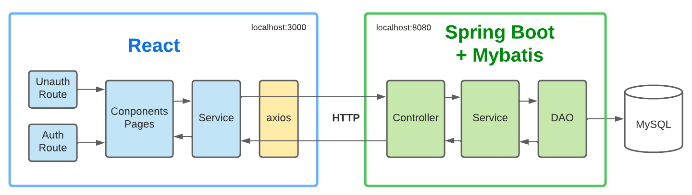
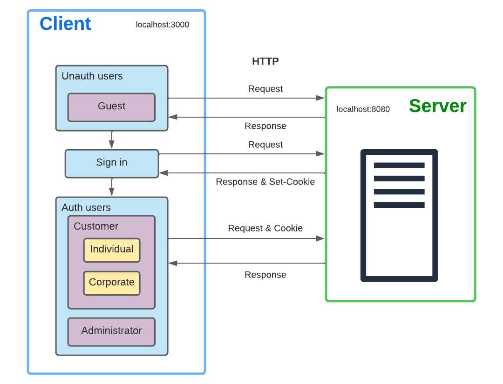

# WOW_Renting

This is the final project for DB course.

Please find details about the databse in the folder [db](https://github.com/Ethan-zc/WOW_Renting/tree/master/db), details about the frontend in [material-kit-react-main](https://github.com/Ethan-zc/WOW_Renting/tree/master/material-kit-react-main).

# Architecture



# Authentication flow



# Directory of backend source codes

```
WOW_Renting/src/main/java/com/wow/rent/
├── WowRentingApplication.java
├── config                    <-- Configuration
├── controller                <-- Process incoming REST requests
├── dao                       <-- Data access objects
├── demo
├── entry                     <-- Entry classes
├── model                     <-- Result class for sending formatted messages to frontend
└── service                   <-- Service implementations
```
