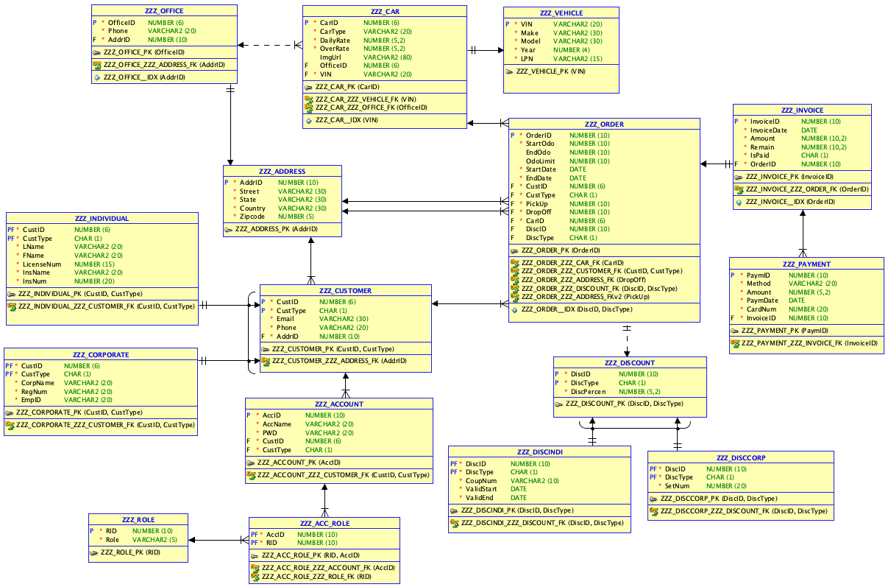

# File description

- DDL.ddl: DDL file that is generated from Oracle
- DDL.sql: DDL file that is converted on sqlines from DDL.ddl
- DeleteData.sql: Script that is used to remove all data in tables
- DropAllTables.sql: Script that is used to drop all tables in the schema
- InitTables.sql: Script that is used to initialize tables (true DDL file for our db)
- InsertData.sql: Script that is used to insert some sample records
- TestCase.sql: Script that is used to validate if triggers are working functionally
- logicalModel.png: Logical model for our db model
- relationalModel.png: Relational model for our db model

# Logical model

# Relational model

